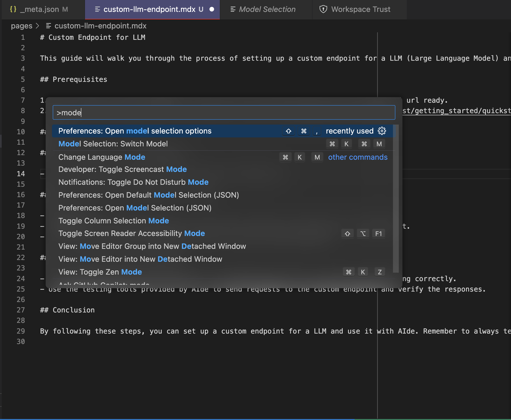
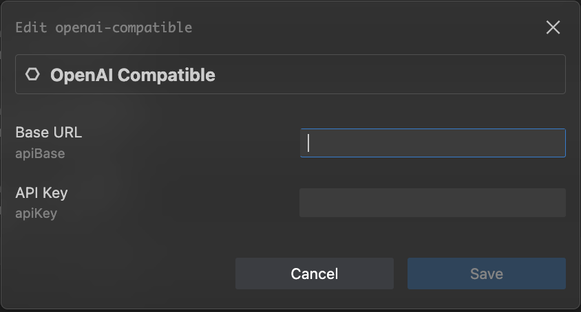
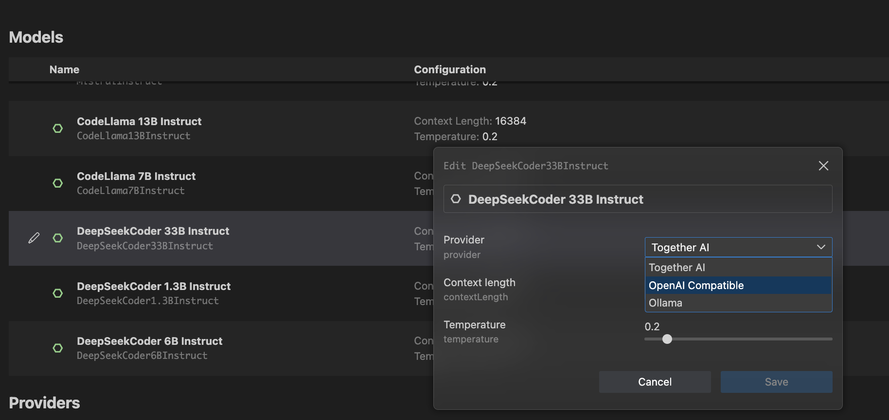

# Custom Endpoint for LLM

This guide will walk you through the process of setting up a custom endpoint for a LLM (Large Language Model) and using it with AIde.

## Prerequisites

1. Have a vllm compatible endpoint running in your preferred endpoint and have the api url ready.
2. Make sure that vllm exposes the [completions endpoint](https://docs.vllm.ai/en/latest/getting_started/quickstart.html#using-openai-completions-api-with-vllm) 

## Steps

### 1. Setting up the Custom Endpoint in Aide

- Open Aide and go to model configuration by doing Ctrl/Cmd + Shift + P and typing `Preferences: Open model selection options`.

- Scroll and find the OpenAI-compatible endpoint and update your Base URL and API Key.

### 2. Change the provider for the preferred model.

- In the model selection page, find the model you are interested in and update the model provider for it.

- Your endpoint should now get traffic from Aide for LLM requests!
- Profit 🎉
