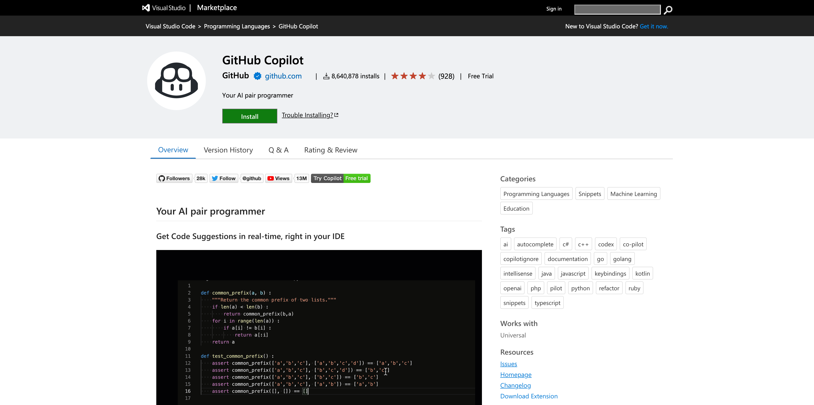
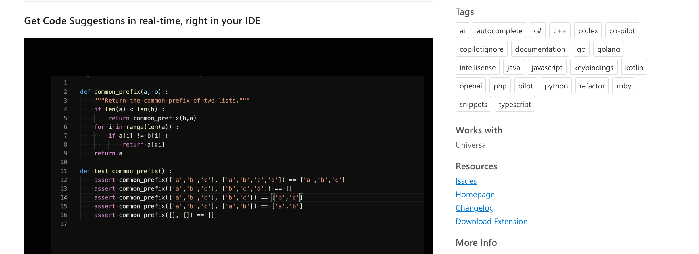
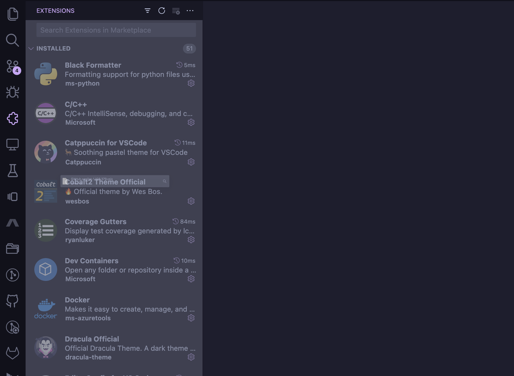
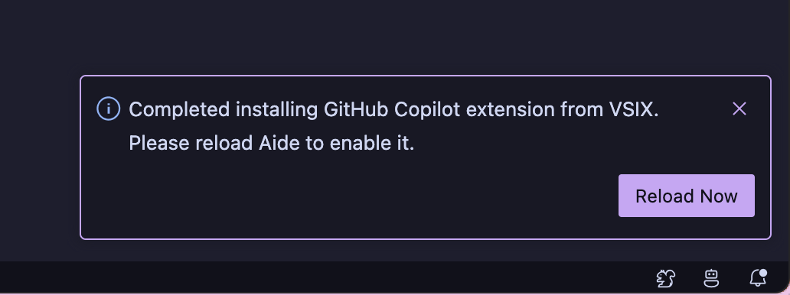
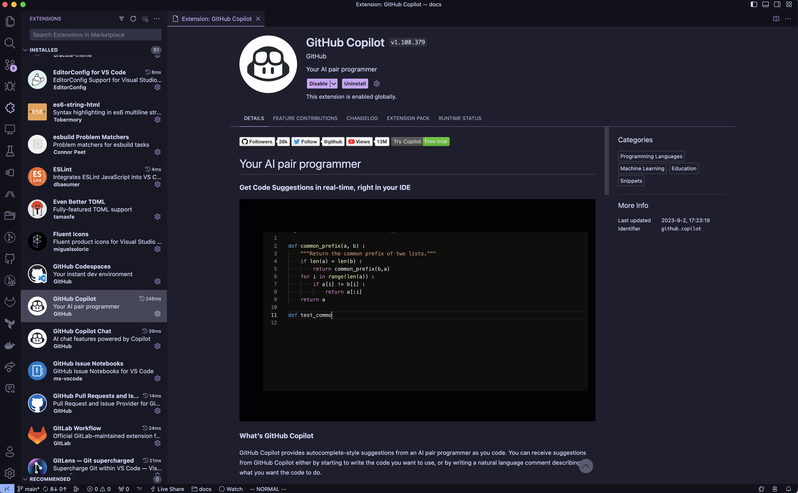

# How to install extensions

Currently, we point to the Open VSX Registry for extensions. This is a community-driven, open-source registry of VS Code extensions. You can find more information about it [here](https://open-vsx.org/). If any of your favourite extensions don't show up here, you can still install them on Aide by following the instructions below.

## Installing extensions from the VS Code Marketplace

1. Go to the VS Code Marketplace and search for the extension you want to install.

2. Click the 'Download Extension' button to download the extension's `.vsix` file.

3. Go to the Aide Extensions page and drag the `.vsix` file into the dropzone.

4. You should see a notification asking to reload the window. Click 'Reload'.

5. The extension should be installed!

