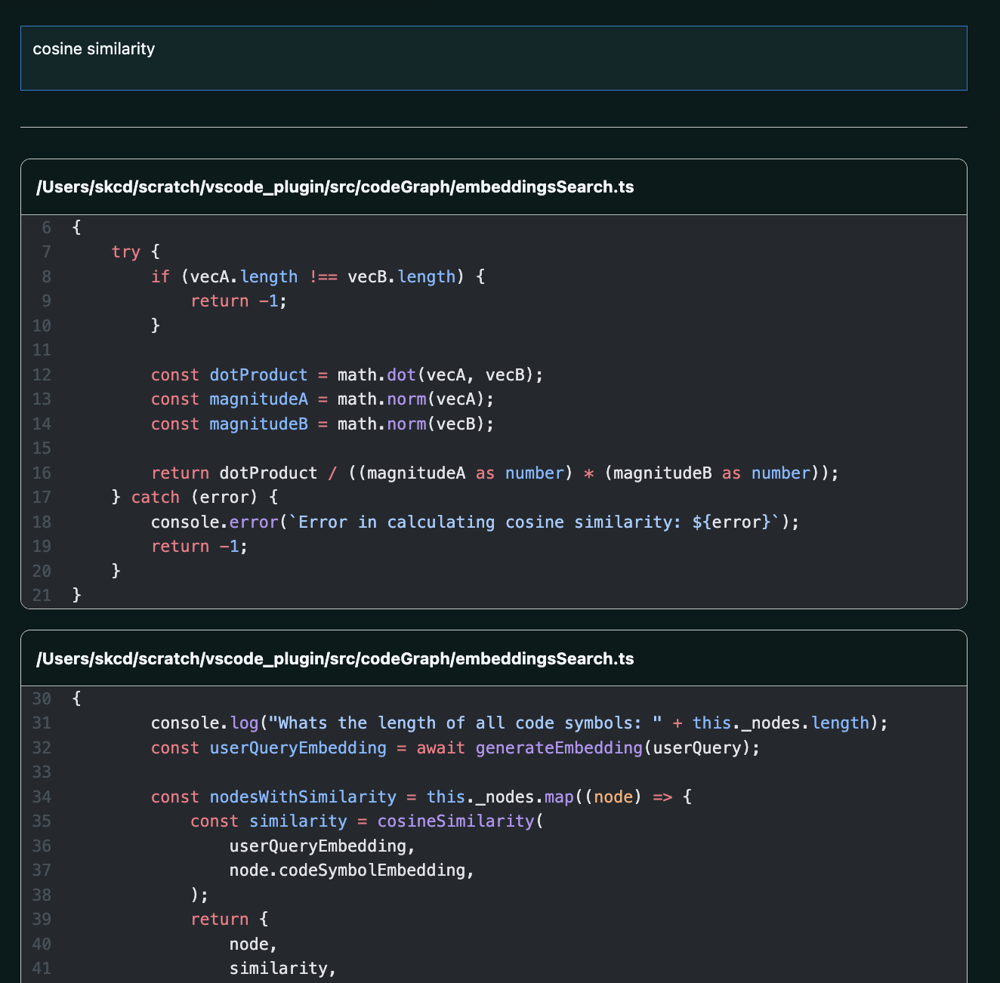
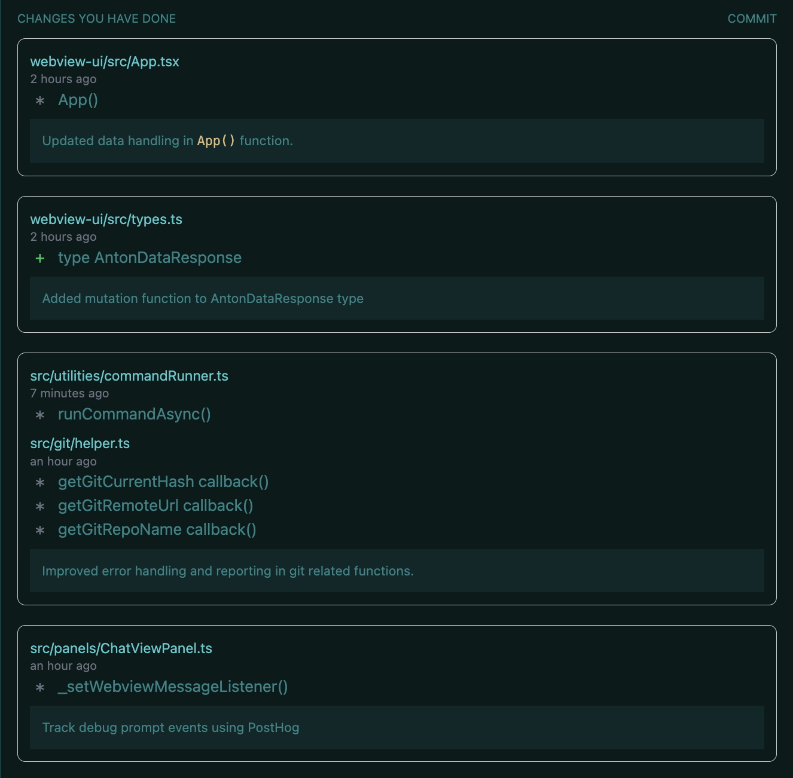

# Features

## 💫 Debug & explore

Describe an issue in your Codebase and let the AI agent navigate, identify, resolve and test the fix.

  <iframe
    width="550"
    height="275"
    style={{
      position: "absolute",
      width: "100%",
      height: "100%",
      left: 0,
      top: 0,
    }}
    src="https://www.youtube.com/embed/VmaQFjNJiAk"
    title="Debugging in the editor"
    frameBorder="0"
    allow="accelerometer; autoplay; clipboard-write; encrypted-media; gyroscope; picture-in-picture; web-share"
    allowFullScreen
  />

## 🔎 Natural language search

Can't remember a particular class or method name? Just describe it in a few words!

**How to access:** You can access this by opening the CodeStory extension from the sidebar and using the text area at the top to search.

## 🥽 Grouped git diffs

See a visual summary of related changes since your last commit.

**How to access:** You can access this by opening the CodeStory extension from the sidebar. The _CHANGES YOU HAVE MADE_ section will auto-populate with your changes.

## ✍ ️ Commit message helper

Writing good commit messages is hard — we do half the work by speaking about the 'what', so you can focus on the 'why'.

**How to access:** In the sidebar extension, click on the _COMMIT_ button when you're ready to commit your changes. You can then select the files you want to commit and write your commit message.

## 🪄 One-click migration from VSCode

All your VSCode settings & extensions can be imported in a single step.

**How to access:** See the [getting started guide](/onboarding#importing-vscode-settings) for more details.

## 📦 CodeStory Provider

You can use the CodeStory provider to try out different LLM models and get access to the autocomplete and chat and inline edit features.

**How to access:** You can access it using the model selection page using Ctrl/Cmd + Shift + P: typing `Preferences: Open model selection options`.

Select the CodeStory Provider as shown below:

