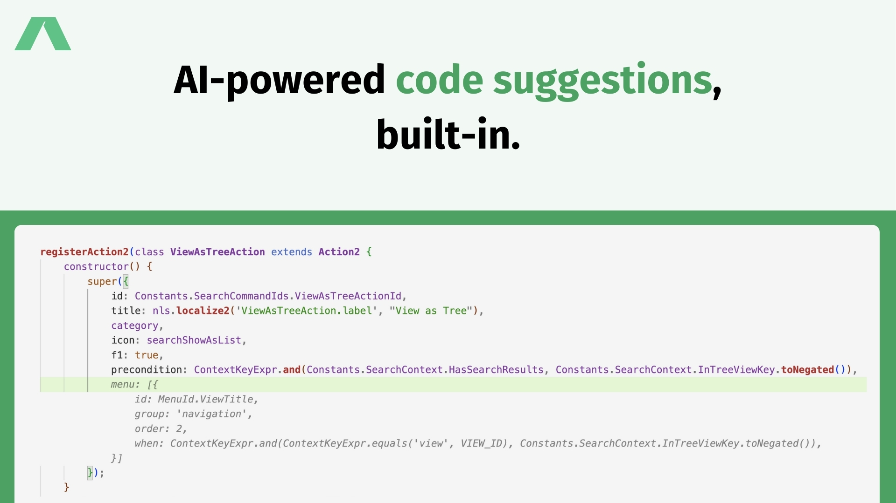
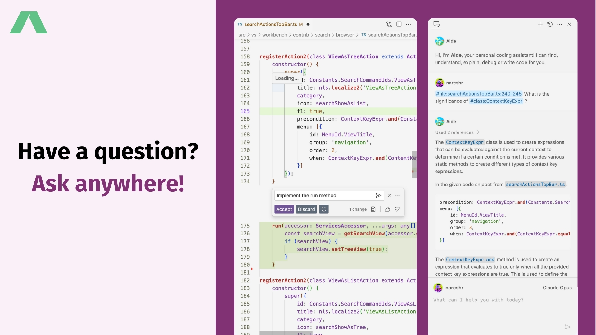
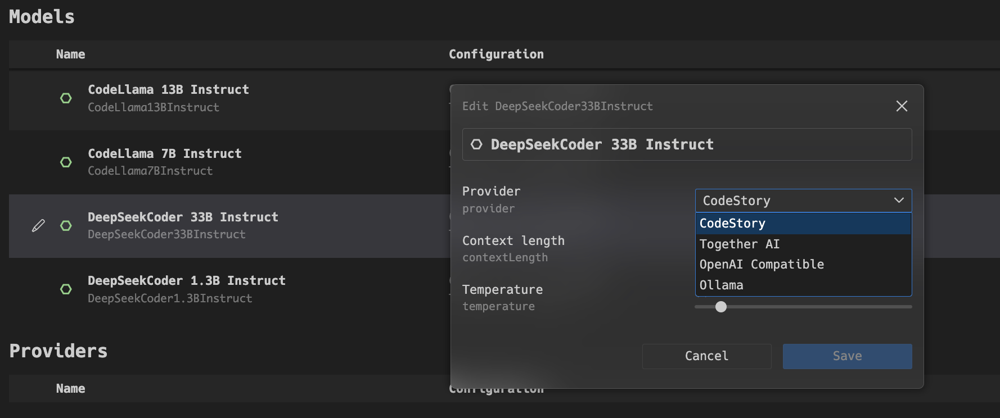
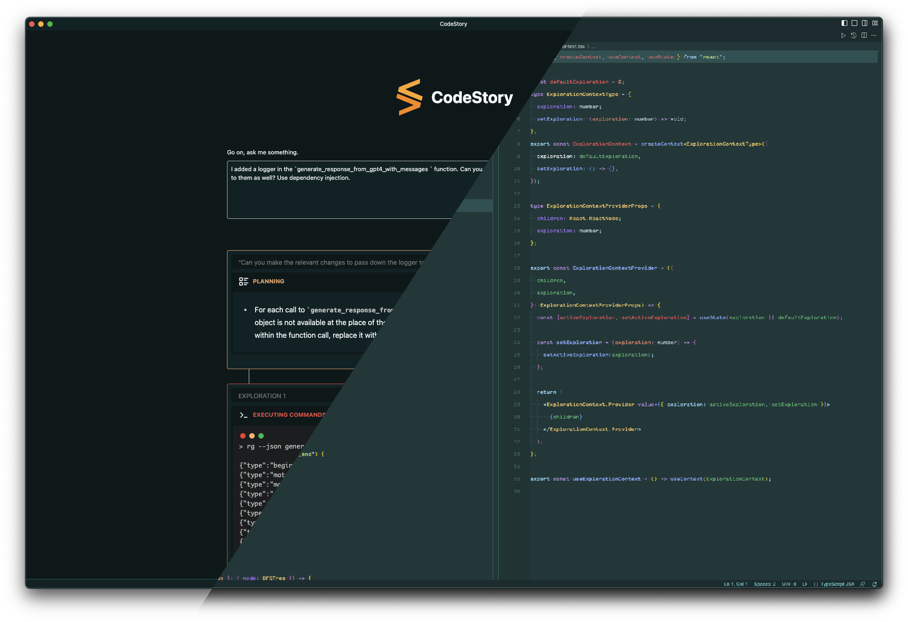

# Features

## All Features

Aide provides AI tooling to help you stay in flow and help you writer code better and faster. Check out all the AI features we provide in the video below:

  <iframe
    width="550"
    height="275"
    style={{
      position: "absolute",
      width: "100%",
      height: "100%",
      left: 0,
      top: 0,
    }}
    src="https://www.youtube.com/watch?v=i8ZXMgnFSo8"
    title="AI features in the editor"
    frameBorder="0"
    allow="accelerometer; autoplay; clipboard-write; encrypted-media; gyroscope; picture-in-picture; web-share"
    allowFullScreen
  />

## ⌨️ Tab autocomplete

Tab-autocomplete works by autocompleting the code as you are typing it out. One of the best parts of the tab-autocomplete is that we not only
look at your open files, but also walk the dependency tree using the Language Server and use Tree-sitter for parsing the codes into recognisable
chunks. This helps us collect the type definitions of the various identifiers in your code, providing a richer and syntatically-correct auto-complete experience.

## 🖥️ Inline code generation

Often times making quick changes to the code is equivalent to deleting or commenting out code, writing a comment, letting copilot autocomplete it and fixing things.
Instead you can call the inline code-editor using `Cmd/Cntrl + I` and give it instructions, you stay in flow and review the work done by the AI.

## 💬 Sidebar chat

Sidebar chat is your powerful AI assistance which can reason across files and knows quite a lot about your codebase. Give it references using `Cmd/Cntrl + L` in the editor and ask it your burning
programming questions. You can use the most powerful coding models like Claude Opus and GPT4 for their powerful code understanding. Even more, yoc can host models on your infrastructure as well. See our list
of supported providers to navigate the selection process.

## 📦 CodeStory Provider

You can use the CodeStory provider to try out different LLM models and get access to the autocomplete and chat and inline edit features.

**How to access:** You can access it using the model selection page using Ctrl/Cmd + Shift + P: typing `Preferences: Open model selection options`.

Select the CodeStory Provider as shown below:

## 🪄 One-click migration from VSCode

All your VSCode settings & extensions can be imported in a single step.

**How to access:** See the [getting started guide](/onboarding#importing-vscode-settings) for more details.

