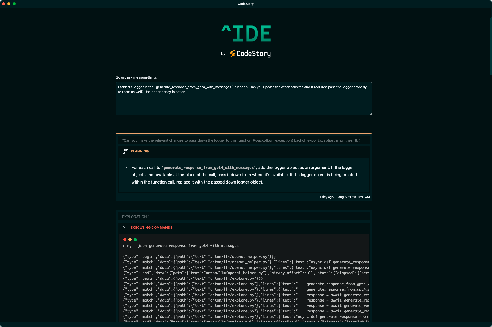

# Welcome to CodeStory

Aide by CodeStory ✨ is an AI-powered mod of VSCode. Imagine a developer tasked with solving a bug, CodeStory can scan the codebase, identify the root cause, make the fix and auto-generate tests to evaluate whether the bug was resolved.

## Features

See the Features page for a detailed walkthrough of the features.

- 💫 **A powerful debug & explore workflow:** Describe an issue in your Codebase and let the AI agent navigate, identify, resolve and test the fix.
- 🔎 **Natural language search:** Can't remember a particular class or method name? Just describe it in a few words!
- 🥽 **Group git diffs:** See a visual summary of related changes since your last commit.
- ✍ ️ **Commit message helper:** Writing good commit messages is hard — we do half the work by speaking about the 'what', so you can focus on the 'why'.
- 🪄 **One-click migration from VSCode:** All your VSCode settings & extensions can be imported in a single step.
- 👀 **A GitHub PR summary bot:** While this is not (yet) a core part of the IDE, our summary bot leaves a summary on every PR, alongside some impact analysis.
