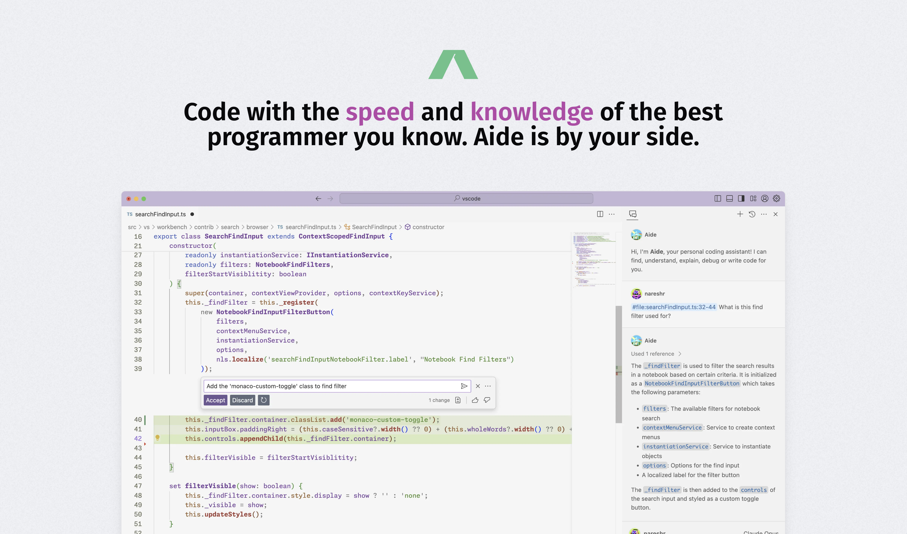

import { useState, useEffect } from "react";

import { Button } from "../components/button";

# Welcome to CodeStory

Aide by CodeStory ✨ is an AI-powered mod of VSCode.
It's built with a hackable architecture and privacy first aspects in mind.

You can use it to run your favorite model right in your editor with very 1-2 steps configuration or changing a config file.

Below is the list of models and the providers we support

| Models                   | Providers                                  |
| ------------------------ | ------------------------------------------ |
| Claude Opus/Sonnet/Haiku | Claude                                     |
| GPT 4, 4.5, 3.5          | OpenAI                                     |
| CodeLlama 70B, 13B, 7B   | Ollama                                     |
| DeepseekCoder 33B, 6.7B  | LMStudio, Ollama, TogetherAI               |
| Mixtral and Mistral      | fireworks.ai, LMStudio, Ollama, TogetherAI |

export const DownloadButton = () => {
  const [release, setRelease] = useState([]);

useEffect(() => {
fetch("https://api.github.com/repos/codestoryai/binaries/releases")
.then((res) => res.json())
.then((releases) => {
setRelease(releases[0]);
});
}, []);

return (

  <a
    href={"https://github.com/codestoryai/binaries/releases"}
    target="_blank"
    rel="noopener noreferrer"
  >
    <Button>Download for your architecture</Button>
  </a>

); };

 

<DownloadButton />

