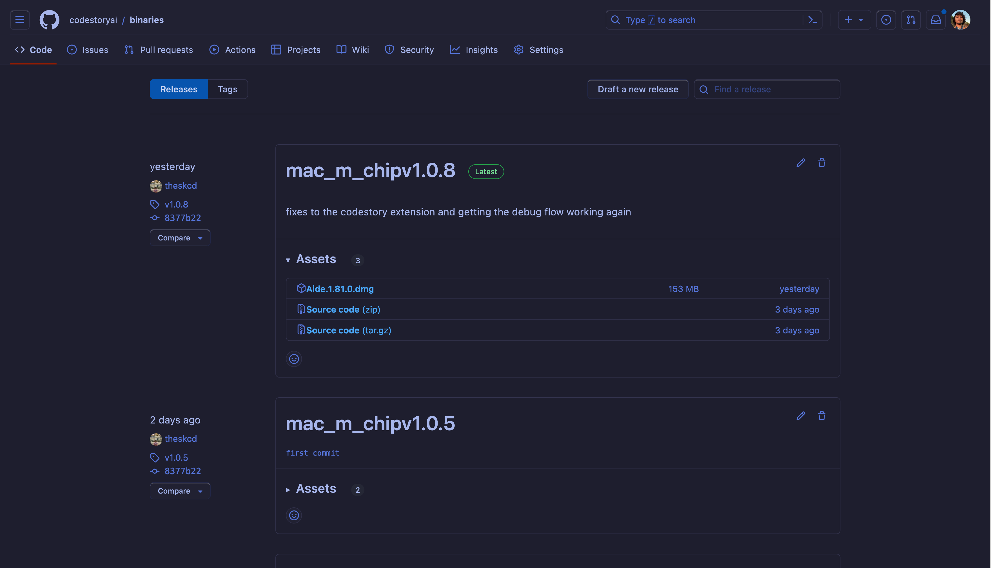
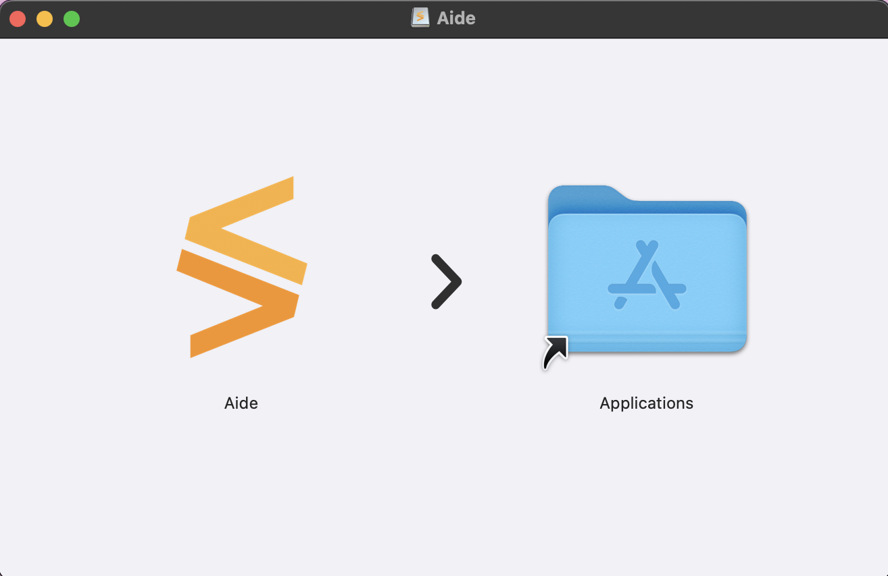
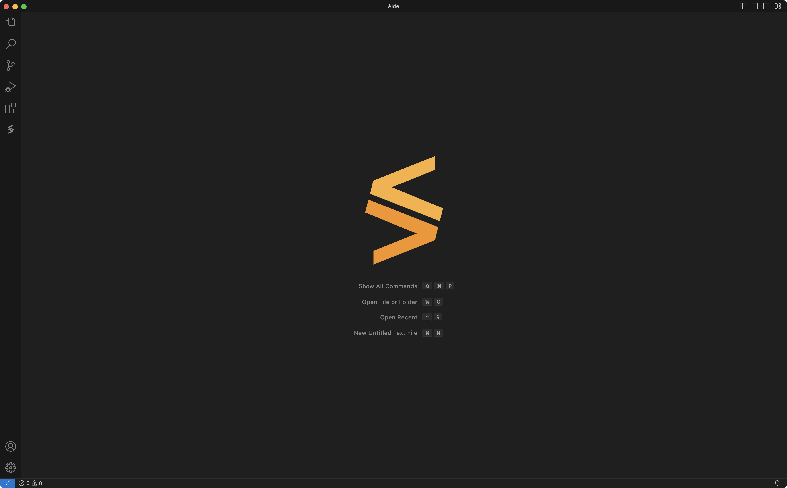
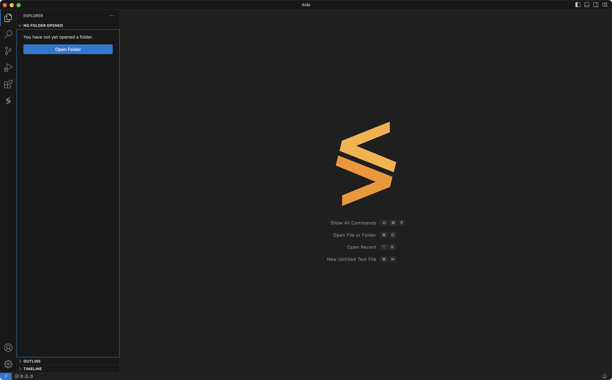
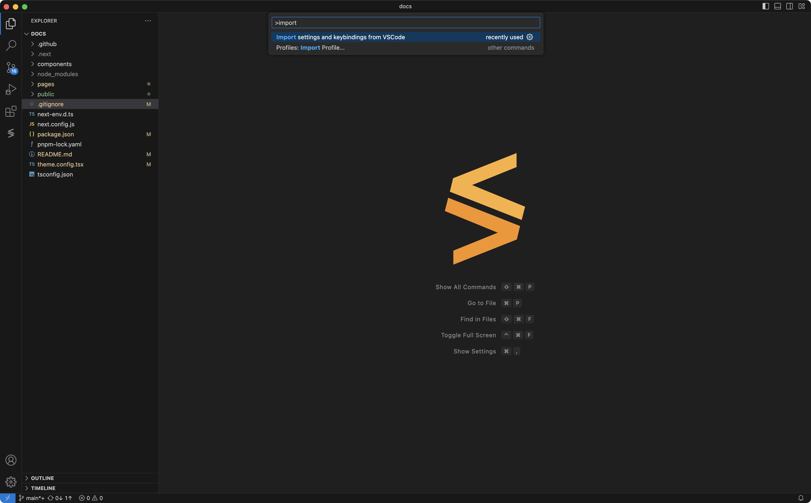
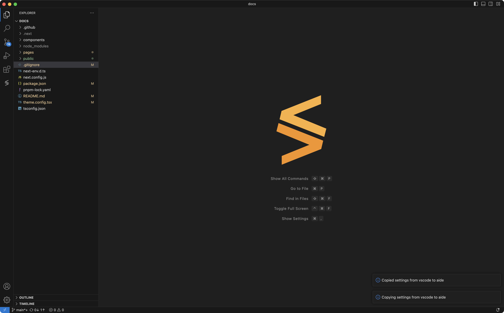
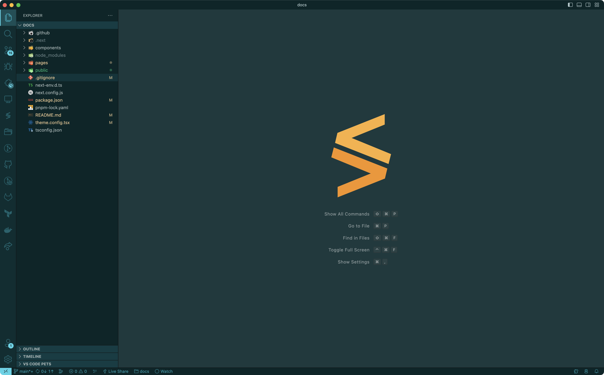

# Getting Started

Aide by CodeStory is currently in **alpha stage**, and supports only **JS/TS projects** and requires **Apple Silicon Macs**.

## Installation

1. Head to CodeStory's [releases page](https://github.com/codestoryai/binaries/releases) and download the latest version of Aide.
   

2. You might get a warning that the app is downloaded from the internet. Click on `Open` to open the app.

   

     
   

3. Open the downloaded file and drag the Aide app to your Applications folder.
   

4. Open Aide from your Applications folder.
   

## Known limitations

At this point in time, a lot of the core functionality is implemented as a VSCode extension. The extension comes pre-installed with Aide, but it has the following limitations:

1. The extension will not open until a JS/TS project is opened in the workspace.
2. If a large project is opened, the extension might take a while to load since the indexing process is currently synchronous.
3. Before running any CodeStory commands, the extension needs to be explicitly activated by clicking on the CodeStory icon in the VSCode status bar.

## Importing VSCode settings

Aide supports importing all your settings and extensions from VSCode. In order to do so,

1. Open a JS/TS project folder.
   

2. Press `Cmd + Shift + P` to open the command palette and search for `Import settings and keybindings from VSCode`. Hit enter to run the command.
   
3. Aide will now import all your settings and extensions from VSCode. This might take a while depending on the number of extensions you have installed in VSCode.
4. Once complete, Aide should automatically reload and you should see all your extensions in the extensions panel.
   
5. In case you don't see your extensions, you can manually reload Aide by pressing `Cmd + R` or by searching for `Reload window` in the command palette.
   
