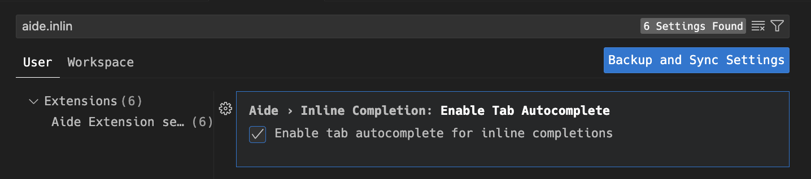
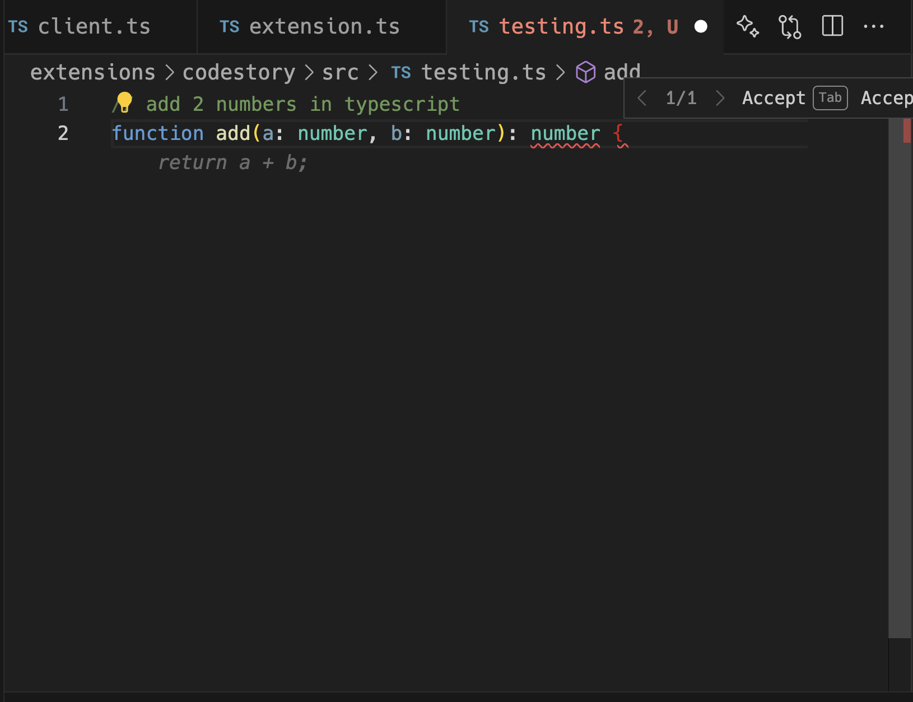

## Tab Autocomplete

### Enable Tab-Autocomplete

To enable Tab-Autocomplete, you need to go to your user settings and toggle the setting: `aide.inlinecompletion.enabletabautocomplete`

Once you have this enabled, refresh your vscode window by doing Cmd/Cntrl + Shift + P: `Reload Window`

Whenever you type you should see the ghost text suggestion in your editor

