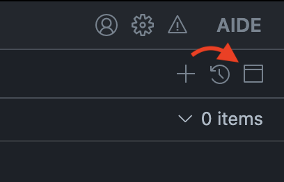
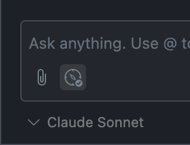

import { Image } from "astro:assets";

## Supported projects

We have first-class support for projects built on [Vite](https://vite.dev), including Vite-based frameworks like [Remix](https://remix.run).

## Getting started

This feature is enabled automatically if Aide detects React in your package.json.

Open your `vite.config` in Aide and click the button that reads "Add Vite plugin". This will automatically install the [`@codestoryai/component-tagger`](https://www.npmjs.com/package/@codestoryai/component-tagger) npm package add the plugin to your Vite configuration.

You can also open the command palette by pressing `Ctrl` + `Shift`+ `P` (`Cmd` + `Shift`+ `P` on Mac) and type "Add Vite plugin" for a more granular installation.

> **This plugin will only run in your "serve" configuration and will not make a difference in your production builds.**

If your project is not based on Vite, or you don't want to add any plugins to your build step, you can still use our agentic features built around React. Without the plugin, there are a few limitations:

1. You must have [source maps](https://web.dev/articles/source-maps) enabled
2. You will be able to inspect only client-rendered components
3. The agents will be more limited in their ability to scope out the component you are looking at

## How to use

Run your client-side rendered app on a local dev server.

Click the browser icon in the assistant view top-right actions, and insert the localhost url and port of your dev server in the command palette that opens.

Make sure you are opening a dev server from the relevant workspace (e.g.: if your portfolio project is being served locally, make sure to open the portfolio workspace on Aide.). The devtools may return relative paths that work only when the correct workspace is open. 

> Start your dev server

> Click on the browser button and insert the dev server port

> A webview will open displaying the dev server contents

This will open up a webview pointing to a local proxy to your dev server – we need this proxy layer to inject a small script to enable React devtools.

At this point, if the devtools pick up React, you will see an inspect icon in the context attachemnt options, next to the clip (and compass, if you are in editing or agentic mode) icon. This will toggle inspecting the React tree on and off.

> The context attachemnt actions before opening the webview

> The context attachemnts when the devtools are connected

