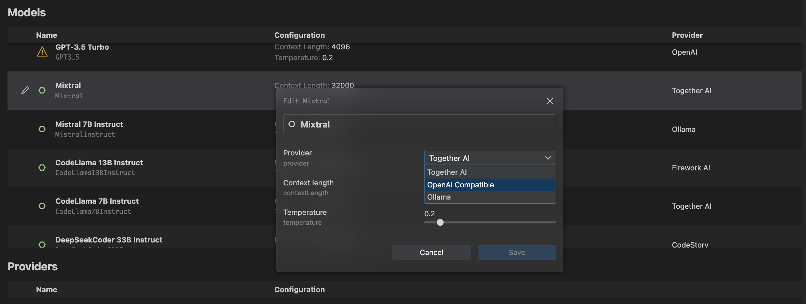
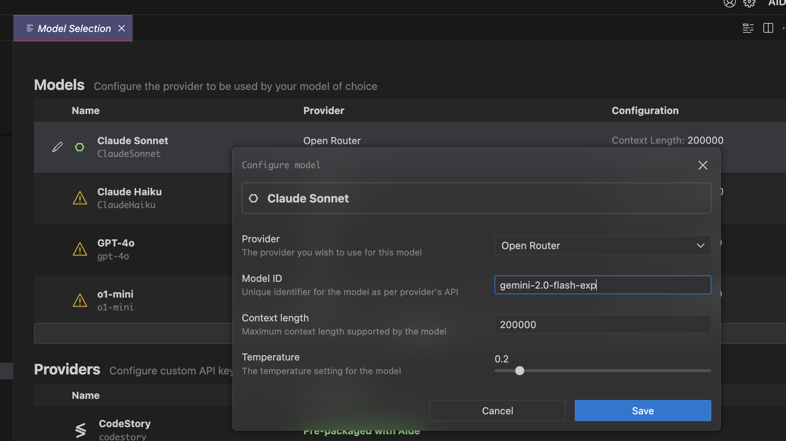
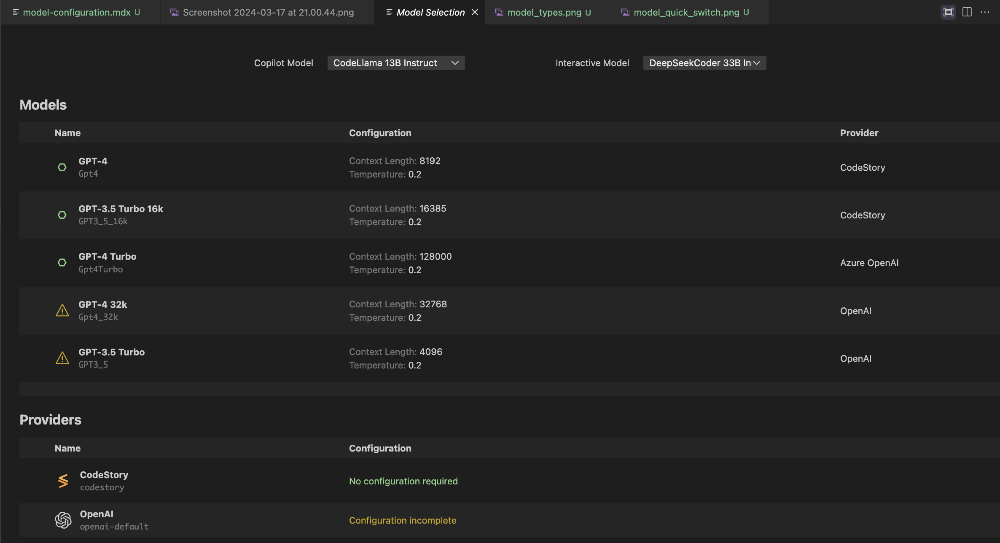

import { Aside } from '@astrojs/starlight/components';

## Language Model Configuration

Aide comes pre-packaged with a few language model defaults that are always best-in-class, and requires zero configuration at your end to get started. However, if you do wish to use a language model of your choice, or even choose a provider you prefer, you can configure this in Aide.

<Aside>Do note that our prompts are currently written to deliver the best performance from the pre-configured models. Performance may vary/degrade when using custom models, and we will not be able to investigate issues where these models don't behave as expected.</Aside>

### Quick Model Switching

You can quickly switch between models using:

- Keyboard shortcut: `⌘/Ctrl + K + M`
- Command palette: Search for "Model Selection: Switch Model"

### Recommended Models

For hosted solutions:

- Claude Sonnet 3.5 (by Anthropic) is currently the best performing model.
- For self-hosted or OSS models, we recommend Qwen models, which have shown excellent performance across various editor scenarios in our testing.

### Provider Setup

Access provider settings by pressing `⌘/Ctrl + Shift + ,`. You'll see a configuration page like this:

Below are the supported providers and their setup instructions:

#### Anthropic

1. Get your API key from [Anthropic's documentation](https://docs.anthropic.com/claude/docs/getting-access-to-claude#step-3-generate-an-api-key)
2. Enter the API key in the Anthropic provider section

#### OpenAI

1. Obtain your API key following [OpenAI's guide](https://help.openai.com/en/articles/4936850-where-do-i-find-my-openai-api-key)
2. Optionally set a custom API base URL for private deployments

#### Azure OpenAI

Required configuration:

- Deployment ID
- API URL
- API Key

#### TogetherAI

1. Create an account and get started using their [quickstart guide](https://docs.together.ai/docs/quickstart)
2. New users receive $25 in free credits to experiment with different models

#### Ollama

No configuration needed - just ensure Ollama is running in the background.

#### LMStudio

Configure the local URL if using a custom port for the LMStudio API server.

#### FireworksAI

1. Generate your API key following their [quickstart guide](https://readme.fireworks.ai/docs/quickstart#:~:text=A%20new%20Fireworks%20developer%20account,new%20API%20key%20a%20name.)
2. Known for fast inference speeds - recommended for copilot-style models

### Custom Model Configuration

For services like OpenRouter, you can customize model IDs:

1. Select any model from the model selection page
2. Rename it and update the model ID as needed

Example: Configuring Gemini-2.0-flash model:

### Switching Providers for Models

You can run the same model through different providers:

1. Click the edit button next to your model
2. Choose your configured provider from the dropdown

Need help with a provider not listed here? Join our [Discord community](https://discord.gg/mtgrhXM5Xf) - we're happy to add support for your custom infrastructure and help with setup.
