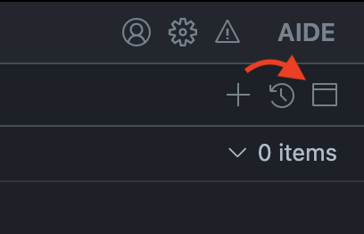
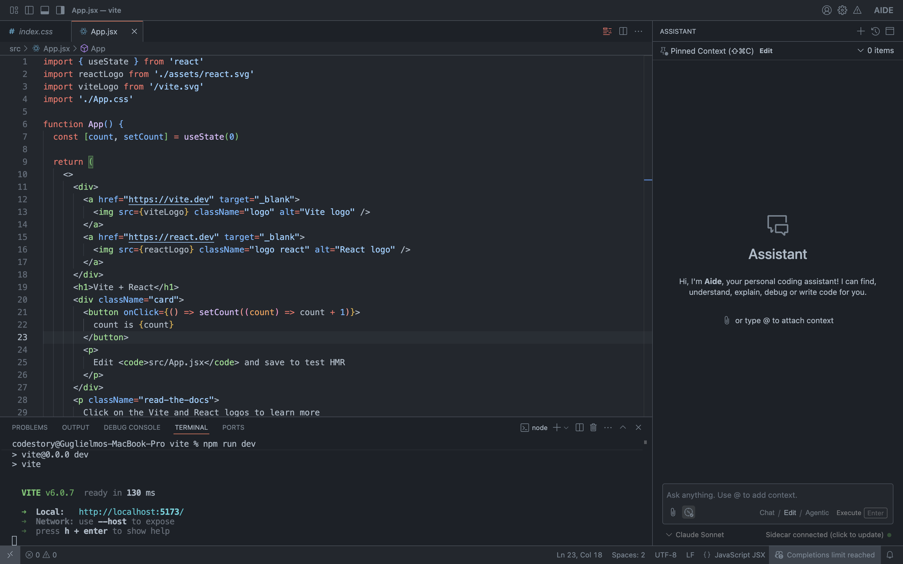
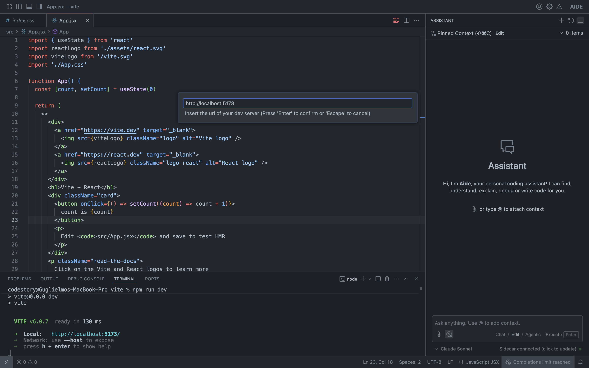
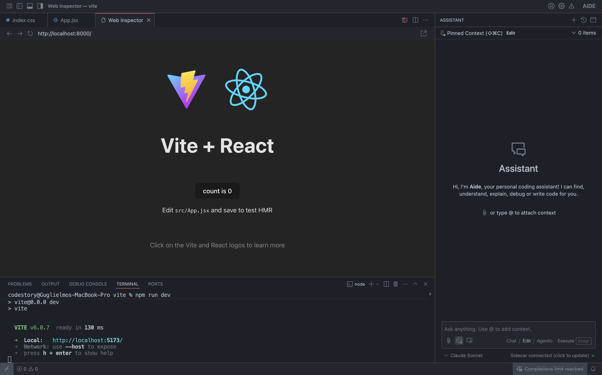
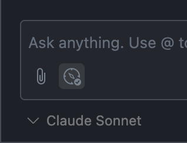
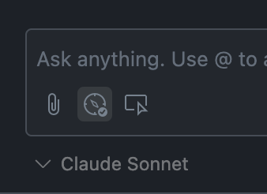

import { Image } from "astro:assets";


## Supported projects

Currently, we only support React projects that use client-side rendering and expose a [source map](https://web.dev/articles/source-maps) in their output. For example, if you are using [Vite](https://vite.dev), make sure you are client-side rendering and either run your app in development mode or [enable source maps in your build](https://vite.dev/config/build-options.html#build-sourcemap).

## Enabling this feature

Open Aide user settings (JSON) in the Command Palette by pressing `Ctrl` + `Shift`+ `P` (`Cmd` + `Shift`+ `P` on Mac), and set `"aide.enableInspectWithDevtools"` to `true`.

```json
"aide": {
    "enableInspectWithDevtools": false
}
```

A button with a browser icon should now appear in the top-right corner of the assistant panel, next to the "New session" (plus icon) and "Previous sessions" (clock icon) buttons.



## How to use

Run your is client-side rendered app on a local dev server.

If you enabled this feature, you will see a the browser icon in the assistant view top-right actions. Click it, and insert the localhost url and port of your dev server in the command palette that opens.



> Start your dev server



> Click on the browser button and insert the dev server port



> A webview will open displaying the dev server contents

This will open up a webview pointing to a local proxy to your dev server – we need this proxy layer to inject a small script to enable React devtools.

At this point, if the devtools pick up React, you will see an inspect icon in the context attachemnt options, next to the clip (and compass, if you are in editing or agentic mode) icon. This will toggle inspecting the React tree on and off.



> The context attachemnt actions before opening the webview



> The context attachemnts when the devtools are connected

## Known issues

We currently use the symbolicated source of a component in order to find the file on the system that corresponds to the React component, and the line range of what part of the underlying JSX was actually clicked.
This has a few implications:

1. A source map needs to be present in order to get get the symbolicated source of a React component.
2. The app needs to be client-rendered, since we can't currently easily get the path of a server component.
3. If the app has thousands of components with several wrapper levels, it's possible you are going to click on the last levels of these trees, which may not necessarily be the most relevant component.
4. You will have to navigate using URLs in the web view instead of clicking around your app links.

We know these are hard limitations, but we are working to remove them and improve both your experience and the value you can get out of this feature.
