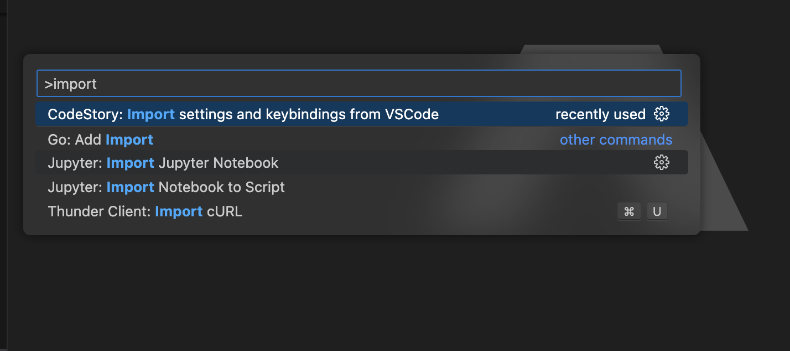

In your command pallete (Cmd/Cntrl + Shift + P) search for `CodeStory: Import settings and keybindings from VSCode`. This will automagically start importing your settings and keybindings from VSCode to Aide.

    