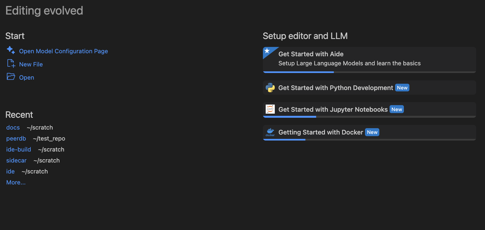

## Installation

### MacOS

1. Head to CodeStory's [releases page](https://github.com/codestoryai/binaries/releases) and download the latest version of Aide.

   <br/>

2. Open the downloaded file and drag the Aide app to your Applications folder.

   <br/>

3. Open Aide from your Applications folder. Use the troubleshooting instructions if you see a warning that [the developer is unidentified](/troubleshooting#unidentified-developer) or that [the app is downloaded from the internet](/troubleshooting#app-downloaded-from-the-internet).

4. You should see the welcome screen.

   

### Linux

1. Download the Linux release from the [releases page](https://github.com/codestoryai/binaries/releases).
2. Create a folder called `aide` under `/usr/share`, using `sudo mkdir -p /usr/share/aide`.
3. Extract the downloaded file using `sudo tar -xvzf <filename>.tar.gz -C /usr/share/aide`.
4. Create a desktop file at `/usr/share/applications/aide.desktop` with the following contents:

```
[Desktop Entry]
Name=Aide
Comment=AI-first code editor
GenericName=Text Editor
Exec=/usr/share/aide/aide --unity-launch %F
Icon=vscode
Type=Application
StartupNotify=false
StartupWMClass=Aide
Categories=TextEditor;Development;IDE;
MimeType=text/plain;inode/directory;application/x-code-workspace;
Actions=new-empty-window;
Keywords=aide;

[Desktop Action new-empty-window]
Name=New Empty Window
Name[de]=Neues leeres Fenster
Name[es]=Nueva ventana vacía
Name[fr]=Nouvelle fenêtre vide
Name[it]=Nuova finestra vuota
Name[ja]=新しい空のウィンドウ
Name[ko]=새 빈 창
Name[ru]=Новое пустое окно
Name[zh_CN]=新建空窗口
Name[zh_TW]=開新空視窗
Exec=/usr/share/aide/aide --new-window %F
Icon=vscode
```

5. You should now be able to access Aide from your application launcher.

## Known limitations

At this point in time, a lot of the core functionality is implemented as a VSCode extension. The extension comes pre-installed with Aide, but it has the following limitations:

1. The extension will not open until a JS/TS project is opened in the workspace.
2. If a large project is opened, the extension might take a while to load since the indexing process is currently synchronous.
3. Before running any CodeStory commands, the extension needs to be explicitly activated by clicking on the CodeStory icon in the VSCode status bar.

## Importing VSCode settings and settings

Aide supports importing all your settings and extensions from VSCode. In order to do so,

1. Click on Import Extensions and Settings from VSCode

   <br/>

2. Once you see the notification that your extensions and settings has been imported (takes 10 seconds), you should see a notification.

3. Reload Aide by pressing `Cmd + Shift + P` and selecting `Developer: Reload window` from the command palette. All your settings and extensions should now be available in Aide.


PS: If you can not find the login page use `cmd/cntr + shift + P` and search for 'Welcome: Open Walkthrough...` and Select Aide walkthrough