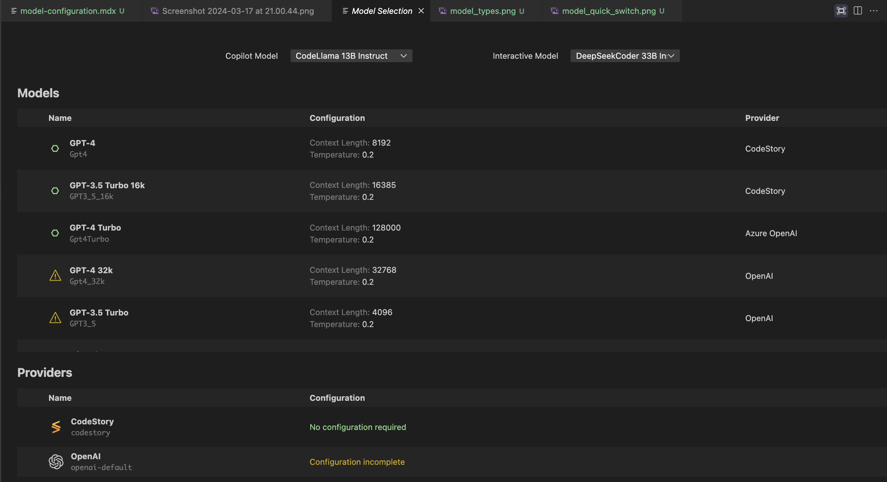
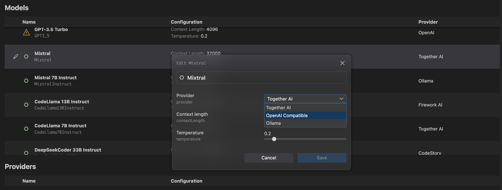
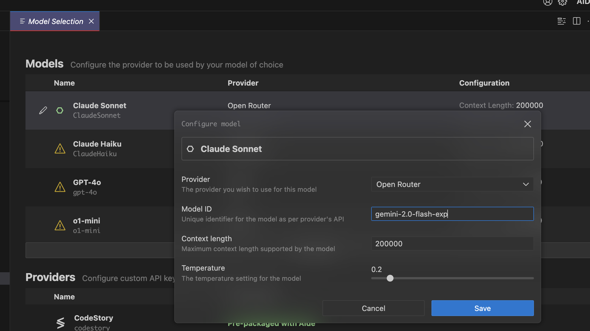

## Large Language Model configuration

### Quick switch between your models
To quick switch between models try out the keyboard shortcut: `Cmd/Cntrl + K + M` or search for `Model Selection: Switch Model`

### Configure models
Aide uses a single kind of models:
- Chat (This is used for interacting with the editor, either via the inline-chat or the sidebar chat)
Chat models, are more smarter and can do various tasks. They can handle scenarios which require making in-editor changes or as a programming partner using the sidebar chat.

Chat models are more varied, the best hosted model right now in the market is Claude Sonnet3.5 and closely.

If you are self-hosting or using OSS models, we highly recommend qwen models (which has been very powerful in our testing and works across the variety of
scenarios we have in the editor)

### Setting up providers
You can access the provider settings page using `Cmd/Cntrl + Shift + ,` you should see a page like this:

Here you can choose from a variety of providers which we support, the list is provided below and we also talk about the specifics of setting them up.

#### Anthropic
Anthropic provider requires you to provider the Anthropic API Key, which you can get from [here](https://docs.anthropic.com/claude/docs/getting-access-to-claude#step-3-generate-an-api-key)
Set this api key in the anthropic provider which you can find by scrolling down the list of the providers.

#### OpenAI
OpenAI has this helper page [here](https://help.openai.com/en/articles/4936850-where-do-i-find-my-openai-api-key)
You can also set a custom API BASE if required (while using private deployment powered by OpenAI)

#### Azure OpenAI
While using Azure OpenAI we require your deployment id, url and the api key. Once you have that enter it for configuration in the provider page.

#### TogetherAI
TogetherAI is pretty straightforward and you can setup your account [here](https://docs.together.ai/docs/quickstart)
You also get $25 free when using TogetherAI, we highly recommending trying out different models here before deciding on one.

#### Ollama
Ollama requires 0 configuration, you should be good to go when you have Ollama running in the background.

#### LMStudio
LMStudio allows you to set a custom port, so you just need to give us the local url and we will talk to the api server running on LMStudio.

#### FireworksAI
Fireworks AI allows you to create your API key [here](https://readme.fireworks.ai/docs/quickstart#:~:text=A%20new%20Fireworks%20developer%20account,new%20API%20key%20a%20name.)
They have one of the fastest inference engines, we recommend using them as a provider for the copilot models.

#### Custom model
If you are using OpenRouter you might want to configure your model id for the model. This can be done on the model selection page where you can pick any model and rename it to your liking, in the screenshot below you can see how I am picking the Sonnet model and changing the model id so it points to the Gemini-2.0-flash model.

    

### Switching model to provider
Since we can have a single model run using multiple inference providers, we allow configuring this on the fly.
Click on the edit button beside the model and chose your configured provider.

Please do not hesitate to reach out on Discord, if this list does not cover the providers you are using. We are happy to add support for your custom infra and help you setup LLMs on your own infra.